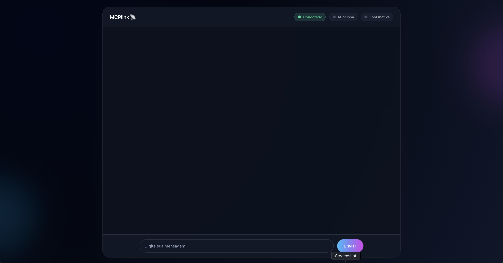

# 🚀 Real-Time Chat with Claude 3.7+ and MCP Tool (Streaming + Approval)

## 🧭 Overview

Full‑stack real‑time chat app with **Next.js + Tailwind CSS** on the frontend and **NestJS (WebSocket Gateway) + ws** on the backend. The AI (**Claude 3.7+**) streams responses (SSE) and can request an **MCP tool** that writes files in chunks, pending explicit user approval.

## ✅ Prerequisites
- Node.js >= 18.17 (requires native `fetch`)
- npm (or a compatible package manager)

## ✨ Features
- Live chat with message history and streaming replies
- Full‑duplex WebSocket between frontend and backend
- Real Anthropic Claude 3.7+ integration (SSE streaming)
- MCP tool for chunked file creation
- Explicit user approval before any tool runs
- Real‑time display of tool chunks while the file is being written
- Status badges: “AI typing…” and “File being created…”

## 🏗️ Architecture
- Frontend: `Next.js 14 + Tailwind`
- Backend: `NestJS (WebSocket) + ws + TypeScript`
- AI: `Anthropic Messages API` with `tools` and `stream` enabled
- MCP Tool: incremental file creation inside `WORKSPACE_DIR`

## 📂 Project Structure

```
backend/
  src/
    app.module.ts
    env.ts
    logger.ts
    main.ts
    metrics.ts
    utils.ts
    http/
      health.controller.ts
      metrics.controller.ts
    modules/chat/
      chat.module.ts
      domain/
        chat_session.ts
        schemas.ts
        types.ts
      gateways/
        chat.gateway.ts
      services/
        anthropic_service.ts
        mcp_tool_service.ts
      usecases/
        process_client_event.usecase.ts
  package.json
  tsconfig.json
  .env.example
  .gitignore

frontend/
  app/
    globals.css
    layout.tsx
    page.tsx
  components/
    approval_modal.tsx
    message_bubble.tsx
    status_badge.tsx
    tool_output_view.tsx
  lib/ws_events.ts
  package.json
  next.config.js
  tailwind.config.js
  postcss.config.js
  tsconfig.json
  .gitignore
```

Note: the backend uses a NestJS WebSocket Gateway and validates all payloads with Zod.

## 🖼️ Screenshot



## 🔑 Environment Variables

- Backend
  - `ANTHROPIC_API_KEY` (required)
  - `ANTHROPIC_MODEL` (optional, default `claude-3-7-sonnet-2025-02-19`)
  - `PORT` (optional, default `4000`)
  - `WS_ALLOWED_ORIGINS` (optional, default `*`)
  - `WORKSPACE_DIR` (optional, default `workspace`)

- Frontend
  - `NEXT_PUBLIC_WS_URL` (optional, default `ws://localhost:4000`)

## ▶️ Running Locally

1) Backend

Create your `.env` (based on `.env.example`) and set your API key:

```
cd backend
npm i
cp .env.example .env
# Edit .env and set ANTHROPIC_API_KEY
npm run dev
```

2) Frontend

```
cd frontend
npm i
NEXT_PUBLIC_WS_URL=ws://localhost:4000 npm run dev
```

Open: http://localhost:3000

Tips:
- To restrict WebSocket origins, set `WS_ALLOWED_ORIGINS` (e.g., `http://localhost:3000`).
- `WORKSPACE_DIR` (default `workspace`) is created relative to where you start the backend.

## 🔁 MCP Tool Flow
1. User sends a chat message
2. AI streams the reply; if it needs the tool, it emits `tool_use`
3. Backend pauses and sends `tool_request` → frontend shows an approval modal
4. On approval ✅: tool writes the file chunk‑by‑chunk, emitting `tool_chunk`
5. Backend sends `tool_result` back to Claude and continues the streamed reply
6. On deny ❌: the conversation continues without running the tool

## 📡 WebSocket Events
- Backend → Frontend
  - `session_created { session_id }`
  - `status_update { ai_typing?, tool_running?, file_path?, busy?, reconnecting?, error? }`
  - `ai_chunk { text }`
  - `assistant_message_completed { reason?: 'ok' | 'error' }`
  - `tool_request { id, name, input }`
  - `tool_chunk { chunk }`
  - `error { message, detail? }`

- Frontend → Backend
  - `user_message { text }`
  - `tool_approval { tool_use_id, approved }`

All WebSocket payloads are validated with **Zod** on the backend. Invalid payloads produce `error { message: 'invalid_payload' | 'invalid_json' }` and are logged.

## 🧪 Tests & Quality

Run the suites (backend + frontend):

```
cd backend && npm test
cd ../frontend && npm test
```

Coverage highlights:
- Backend (Vitest): payload validation, approved/denied tool flow, tool error, auto‑resume on invalid tool input.
- Frontend (Vitest + RTL): approval modal interactions and error handling.

## 🔍 Observability
- Structured logs (`logger.ts`) with level (`info|warn|error`), ISO timestamp, and context (e.g., `session_id`, `tool_use_id`).
- In‑memory metrics exposed via `GET /metrics` (Prometheus format) — counters for WebSocket connections, Anthropic requests, tool approvals, and average streaming/resume durations.
- `GET /health` endpoint is available.
- Critical errors are surfaced to the UI with friendly messages and visual state (badges/alerts) for reconnect/busy/tool failures.

## 🧩 Requirements & Guarantees
- ✅ No mocks: uses the official Anthropic API with SSE
- ✅ End‑to‑end real‑time streaming (AI and MCP)
- ✅ Modular code (services, utils, components)
- ✅ Flow states via `status_update`

## 🧰 Handy Examples
- Ask the AI: “Create a file `notes/hello.txt` with content: Hello world”.
  - The frontend will show an approval modal with the tool input.
  - On approval, you’ll see `tool_chunk` as content is written.
  - The file is created at `WORKSPACE_DIR/notes/hello.txt`.

## 🛡️ Security & Restrictions
- The tool uses `safe_join` to prevent path traversal; it only writes inside `WORKSPACE_DIR`.
- `WS_ALLOWED_ORIGINS` controls which origins can connect via WebSocket.

## 🧯 Troubleshooting
- Backend emits localized (pt‑BR) messages for AI errors. Common cases:
  - “Saldo insuficiente para usar a API da Anthropic…” → Low balance/Plans & Billing.
  - “Não autorizado. Verifique sua ANTHROPIC_API_KEY.” → Invalid/missing key.
  - “Limite de uso excedido. Aguarde e tente novamente.” → Rate limit exceeded.
  - “Serviço da IA indisponível no momento…” → 5xx from provider.
- Tool errors:
  - `invalid_path`: path outside `WORKSPACE_DIR`.
  - `write_failed` / `tool_error`: check permissions and disk space.

## 📚 References
- Anthropic: https://docs.anthropic.com/en/docs/get-started
- Bedrock: https://docs.anthropic.com/en/docs/claude-code/amazon-bedrock
- Tool Use: https://docs.aws.amazon.com/bedrock/latest/userguide/model-parameters-anthropic-claude-messages-tool-use.html
